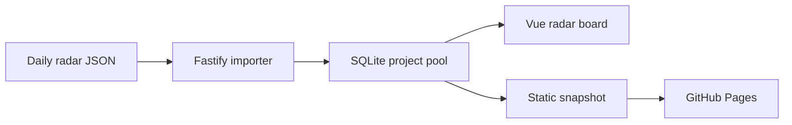

# AI Daily Product Radar

<p align="center">
  <a href="https://github.com/brocademaple/ai-daily-product-radar/actions/workflows/pages.yml">
    
  </a>
  <a href="README.md">中文</a>
</p>

<p align="center">
  A searchable, reviewable, public GitHub project pool built from daily AI-native product judgments.
</p>

<p align="center">
  <a href="https://brocademaple.github.io/ai-daily-product-radar/"><strong>Live demo</strong></a>
  ·
  <a href="#run-locally">Run locally</a>
  ·
  <a href="docs/roadmap.md">Roadmap</a>
</p>


## What It Is

AI Daily Product Radar is an open-source radar board for organizing Codex-generated AI Native Product GitHub briefings.

It tracks whether a repository looks like a real product, who it serves, what makes it AI-native, and whether it deserves cloning, watching, publishing, or skipping. Repeated appearances of the same GitHub repository are merged into one project card, while every historical judgment remains inspectable.

## Live Demo

- GitHub Pages: <https://brocademaple.github.io/ai-daily-product-radar/>
- Current public dataset: 42 historical runs, 640 deduplicated GitHub projects, 777 history entries
- Latest data window: 2026-07-13
- Demo mode: static snapshot, no backend required

## What You Can Do

| Capability | Description |
| --- | --- |
| Global project pool | Merge the same GitHub repo into one card across daily runs |
| Four judgment columns | Sort by the latest judgment: top picks, watchlist, low signal, or published |
| History trail | Open a project to inspect dates, scores, categories, and reasons |
| Decision fields | Keep audience, AI-native angle, growth signal, runnability, and recommended action |
| Bilingual UI | Default to Chinese while preserving original English source text |
| Static publishing | GitHub Pages reads `radar-snapshot.json` directly without an API server |

## Data Provenance

The public board is generated from historical daily run JSON:

```text
data/runs/*.json
```

The importer reads complete runs with `top_projects`, `watchlist`, and `skipped_projects`. Sidecar files such as candidate search output, Feishu message drafts, and Yuque retry notes are skipped.

Aggregation flow:



These judgments come from historical Codex outputs. Stars, READMEs, install steps, and repository activity may have changed, so serious decisions should re-audit the original GitHub pages.

## Run Locally

Backend:

```bash
cd backend
npm install
cp .env.example .env
npm run dev
```

Frontend:

```bash
cd frontend
npm install
npm run dev
```

Open:

```text
http://127.0.0.1:5173/radar
```

Import historical runs:

```bash
curl -X POST http://127.0.0.1:3000/api/radar/import/local-runs
```

The backend `RADAR_RUNS_DIR` environment variable controls the default import directory.

## Deploy to GitHub Pages

The repository includes `.github/workflows/pages.yml`. On every push to `main`, GitHub Actions installs frontend dependencies, builds the static frontend, and publishes `frontend/dist`.

After adding a daily run, rebuild the static data:

```bash
node scripts/build-radar-snapshot.mjs
node frontend/scripts/radar-translations.mjs generate
```

Local Pages build:

```bash
cd frontend
VITE_RADAR_DATA_MODE=static \
VITE_ROUTER_MODE=hash \
VITE_BASE_PATH=/ai-daily-product-radar/ \
npm run build
```

## Project Structure

```text
frontend/
  src/modules/radar/      # Vue board, static snapshot client, Chinese UI
  public/                 # radar-snapshot.json and translation assets
backend/
  src/modules/radar/      # Fastify routes, zod schema, importer, repository
.github/workflows/
  pages.yml               # GitHub Pages deployment
docs/
  roadmap.md              # Product roadmap
```

## Stack

- Frontend: Vue 3, TypeScript, Less, Vite, Pinia, Vue Router
- Backend: Node.js, Fastify, TypeScript, zod
- Database: SQLite for local demo, PostgreSQL-ready through the DB abstraction
- Publishing: GitHub Pages static demo

## Verification

```bash
cd frontend
../backend/node_modules/.bin/tsx --test src/modules/radar/i18n/index.test.ts
npm run type-check
npm run lint
npm run build

cd ../backend
npm test
npm run type-check
npm run lint
npm run build

cd ..
bash .agents/skills/vibecoding-verify/scripts/verify.sh
```
