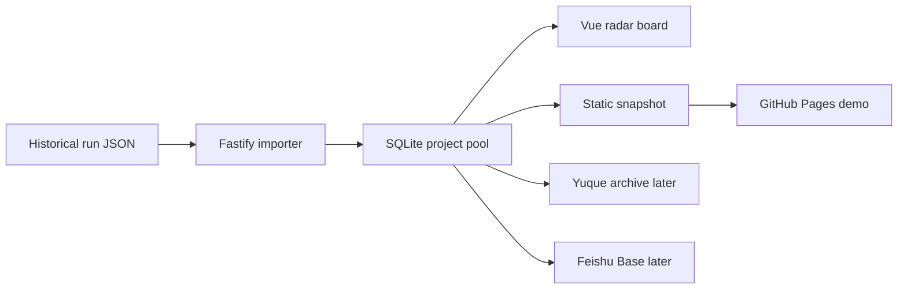

# AI Daily Product Radar

[](https://github.com/brocademaple/ai-daily-product-radar/actions/workflows/pages.yml)
[中文](README.md)

A public, reviewable project board built from historical Codex-generated AI product radar runs.

- **Live demo**: [brocademaple.github.io/ai-daily-product-radar](https://brocademaple.github.io/ai-daily-product-radar/)
- **Current public dataset**: 31 historical runs, 407 deduplicated GitHub projects
- **Full local mode**: Vue board + Fastify API + SQLite importer
- **Public demo mode**: GitHub Pages static snapshot, no backend required

## Why It Exists

The valuable part of a daily AI product radar is not the list. It is the judgment:

- Is this repository shaped like a real product?
- Who is it for, and what is the AI-native angle?
- Is it runnable product, infrastructure, a demo, or low-signal noise?
- Should it be cloned, watched, published, or skipped?

AI Daily Product Radar turns those judgments from chat transcripts into a searchable, aggregated, public project pool.

## What You Can Inspect

- **Global Project Pool**: one card per deduplicated GitHub repository.
- **Top Picks / Watchlist / Skip**: board columns based on the latest judgment.
- **Seen Count**: first seen date, latest seen date, and repeated appearances.
- **Project History**: card details show previous radar entries for the same repo.
- **Decision Fields**: score, category, audience, AI-native angle, growth signal, runnability, and recommended action.

## Data Provenance

The public board is not a frontend mock. It is generated from structured historical run JSON files:

```text
data/runs/*.json
```

The importer skips sidecar files such as candidate search output, Feishu message drafts, and Yuque retry drafts. It only imports complete daily runs with `top_projects`, `watchlist`, and `skipped_projects`. The current static snapshot is aggregated from 31 valid runs.

These judgments come from historical Codex Daily Radar outputs. Live GitHub stars, READMEs, install steps, and activity may have changed, so serious decisions should re-audit the original repositories.

## Architecture



Stack:

- Frontend: Vue 3, TypeScript, Less, Vite, Pinia, Vue Router
- Backend: Node.js, Fastify, TypeScript, zod
- Database: SQLite for local demo, PostgreSQL-ready through the existing DB abstraction
- Publishing: GitHub Pages static demo; Yuque and Feishu are follow-up archival/collaboration targets

## Run Locally

Backend:

```bash
cd backend
npm install
cp .env.example .env
npm run dev
```

Frontend:

```bash
cd frontend
npm install
npm run dev
```

Open:

```text
http://127.0.0.1:5173/radar
```

Import historical runs:

```bash
curl -X POST http://127.0.0.1:3000/api/radar/import/local-runs
```

The default import directory is controlled by the backend `RADAR_RUNS_DIR` environment variable.

## Deploy to GitHub Pages

This repository includes `.github/workflows/pages.yml`.

On every push to `main`, the workflow:

1. Installs `frontend/` dependencies.
2. Builds the frontend in static data mode.
3. Uses `/ai-daily-product-radar/` as the Pages base path.
4. Publishes `frontend/dist` to GitHub Pages.

You can also simulate the static build locally:

```bash
cd frontend
VITE_RADAR_DATA_MODE=static \
VITE_ROUTER_MODE=hash \
VITE_BASE_PATH=/ai-daily-product-radar/ \
npm run build
```

## Development And Verification

The project uses closed-loop modules under `src/modules/<name>/`. Backend contracts are zod schemas; frontend types mirror those response fields.

Useful checks:

```bash
cd backend && npm test
cd frontend && npm run type-check && npm run lint && npm run build
cd ../backend && npm run type-check && npm run lint && npm run build
bash .agents/skills/vibecoding-verify/scripts/verify.sh
```

## Roadmap

- GitHub Pages static demo for the public project pool.
- Local dynamic import from historical run JSON.
- Yuque report archival under `向26出发 / AI Daily Product Radar`.
- Feishu Base sync for a collaborative project board.
- Later: live GitHub audit, scheduled runs, publish status, and review analytics.

See [docs/roadmap.md](docs/roadmap.md).
