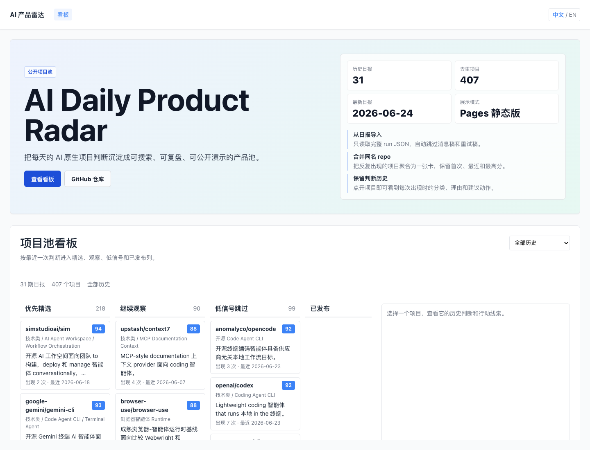
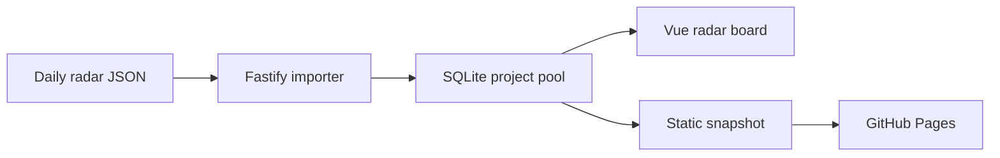

# AI Daily Product Radar

<p align="center">
  <a href="https://github.com/brocademaple/ai-daily-product-radar/actions/workflows/pages.yml">
    
  </a>
  <a href="README.en.md">English</a>
</p>

<p align="center">
  把每天的 AI 原生项目判断沉淀成一个可搜索、可复盘、可公开展示的 GitHub 项目池。
</p>

<p align="center">
  <a href="https://brocademaple.github.io/ai-daily-product-radar/"><strong>在线 Demo</strong></a>
  ·
  <a href="#本地运行">本地运行</a>
  ·
  <a href="docs/roadmap.md">Roadmap</a>
</p>



## 这是什么

AI Daily Product Radar 是一个开源雷达看板，用来整理 Codex 每天生成的 AI Native Product GitHub 简报。

它关心的不是“今天有哪些热门 repo”，而是每个 repo 是否已经有真实产品形态、面向谁、AI native 点在哪里、是否值得复刻或继续观察。历史判断会被聚合成项目池，同一个 GitHub repo 只保留一张项目卡，同时保留每次出现时的判断记录。

## 在线体验

- GitHub Pages: <https://brocademaple.github.io/ai-daily-product-radar/>
- 当前公开数据: 35 期历史日报，484 个去重 GitHub 项目，615 条项目历史记录
- 最新数据窗口: 2026-06-29
- 展示模式: 静态 snapshot，无需后端服务

## 你可以在看板里做什么

| 能力 | 说明 |
| --- | --- |
| 全局项目池 | 同一个 GitHub repo 自动合并为一张卡，避免每天重复看同一项目 |
| 四列判断 | 按最近一次判断进入优先精选、继续观察、低信号跳过、已发布 |
| 历史轨迹 | 点开项目可以看到它每次出现的日期、分数、分类和理由 |
| 决策字段 | 记录目标用户、AI 原生角度、增长信号、可运行性和建议动作 |
| 中英显示 | 页面默认中文，保留英文原文并标记未翻译内容 |
| 静态发布 | GitHub Pages 直接读取 `radar-snapshot.json`，公开展示不依赖 API |

## 数据怎么来

公开页面的数据来自历史日报 JSON:

```text
data/runs/*.json
```

导入器只读取完整日报 run，要求包含 `top_projects`、`watchlist`、`skipped_projects`。候选搜索结果、飞书消息稿、语雀重试稿等 sidecar 文件会被跳过。

聚合过程:



需要注意: 看板里的判断来自历史 Codex 产物。项目 star、README、安装方式和活跃度可能已经变化，严肃使用前应重新审计 GitHub 原始页面。

## 本地运行

启动后端:

```bash
cd backend
npm install
cp .env.example .env
npm run dev
```

启动前端:

```bash
cd frontend
npm install
npm run dev
```

打开:

```text
http://127.0.0.1:5173/radar
```

导入历史数据:

```bash
curl -X POST http://127.0.0.1:3000/api/radar/import/local-runs
```

默认导入目录由后端环境变量 `RADAR_RUNS_DIR` 控制。

## GitHub Pages 发布

仓库内置 `.github/workflows/pages.yml`。推送到 `main` 后，GitHub Actions 会安装前端依赖，使用静态数据模式构建，并发布 `frontend/dist`。

本地模拟 Pages 构建:

```bash
cd frontend
VITE_RADAR_DATA_MODE=static \
VITE_ROUTER_MODE=hash \
VITE_BASE_PATH=/ai-daily-product-radar/ \
npm run build
```

## 项目结构

```text
frontend/
  src/modules/radar/      # Vue 看板、静态 snapshot 客户端、中文显示
  public/                 # radar-snapshot.json 和翻译资源
backend/
  src/modules/radar/      # Fastify 路由、zod schema、导入器、仓储层
.github/workflows/
  pages.yml               # GitHub Pages 自动发布
docs/
  roadmap.md              # 后续规划
```

## 技术栈

- Frontend: Vue 3, TypeScript, Less, Vite, Pinia, Vue Router
- Backend: Node.js, Fastify, TypeScript, zod
- Database: SQLite 本地演示，保留 PostgreSQL 适配
- Publish: GitHub Pages 静态展示

## 开发验证

```bash
cd frontend
../backend/node_modules/.bin/tsx --test src/modules/radar/i18n/index.test.ts
npm run type-check
npm run lint
npm run build

cd ../backend
npm test
npm run type-check
npm run lint
npm run build

cd ..
bash .agents/skills/vibecoding-verify/scripts/verify.sh
```

## Roadmap

- GitHub Pages 静态展示: 已完成
- 本地动态导入: 已完成
- 中文优先的公开页面与 README: 进行中
- 语雀归档: 将完整日报发布到 `向26出发 / AI Daily Product Radar`
- 飞书多维表格: 将项目卡片同步为协作看板
- 后续扩展: 实时 GitHub 审计、定时任务、发布状态和复盘统计
