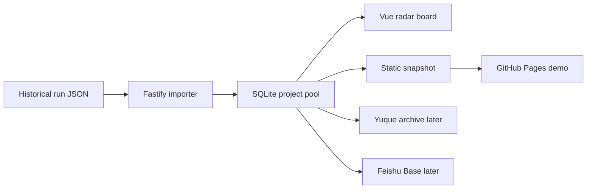

# AI Daily Product Radar

[](https://github.com/brocademaple/ai-daily-product-radar/actions/workflows/pages.yml)
[English](README.en.md)

把每天由 Codex 生成的 AI 原生产品雷达，沉淀成一个可以公开展示、持续复盘、继续行动的项目看板。

- **在线 Demo**：[brocademaple.github.io/ai-daily-product-radar](https://brocademaple.github.io/ai-daily-product-radar/)
- **当前公开数据**：31 个历史 runs，407 个去重 GitHub 项目
- **本地完整模式**：Vue 看板 + Fastify API + SQLite 导入器
- **公开展示模式**：GitHub Pages 静态 snapshot，无需后端

## 为什么做这个

每天看 AI 项目时，真正有价值的不是榜单，而是判断过程：

- 这个 repo 是否已经有真实产品形态？
- 它面向谁，AI native 点在哪里？
- 它是可运行产品、基础设施、demo，还是低信号噪音？
- 值得复刻、跟踪、发布，还是应该跳过？

AI Daily Product Radar 把这些判断从聊天记录里拿出来，变成一个可搜索、可聚合、可公开演示的项目池。

## 可以看什么

- **Global Project Pool**：同一个 GitHub repo 自动合并成一张项目卡。
- **Top Picks / Watchlist / Skip**：按最近一次判断进入不同看板列。
- **Seen Count**：看到一个项目被多次提及、首次出现和最近出现时间。
- **Project History**：点击卡片查看历次出现记录和当时的判断理由。
- **Decision Fields**：分数、分类、目标用户、AI 原生角度、增长信号、可运行性和建议动作。

## 数据来源

公开页面里的数据不是前端 mock。它来自本地历史目录中的结构化日报 JSON：

```text
data/runs/*.json
```

导入器会跳过候选搜索结果、飞书消息稿、语雀重试稿等 sidecar 文件，只导入包含完整 `top_projects`、`watchlist`、`skipped_projects` 的日报 run。当前静态 snapshot 是从 31 个有效 run 聚合而来。

需要注意：这些判断来自历史 Codex Daily Radar 产物。项目的实时 star、README、安装方式和活跃度可能已经变化，严肃使用前应重新审计 GitHub 原始页面。

## 架构



技术栈：

- 前端：Vue 3、TypeScript、Less、Vite、Pinia、Vue Router
- 后端：Node.js、Fastify、TypeScript、zod
- 数据库：SQLite 本地演示，保留 PostgreSQL 适配能力
- 发布：GitHub Pages 静态展示；语雀 / 飞书作为后续归档和协作目标

## 本地运行

启动后端：

```bash
cd backend
npm install
cp .env.example .env
npm run dev
```

启动前端：

```bash
cd frontend
npm install
npm run dev
```

打开：

```text
http://127.0.0.1:5173/radar
```

导入历史数据：

```bash
curl -X POST http://127.0.0.1:3000/api/radar/import/local-runs
```

默认导入路径由后端环境变量 `RADAR_RUNS_DIR` 控制。

## GitHub Pages 部署

仓库已包含 GitHub Actions workflow：`.github/workflows/pages.yml`。

推送到 `main` 后，workflow 会：

1. 安装 `frontend/` 依赖。
2. 使用静态数据模式构建前端。
3. 设置 Pages base path 为 `/ai-daily-product-radar/`。
4. 发布 `frontend/dist` 到 GitHub Pages。

本地也可以模拟静态构建：

```bash
cd frontend
VITE_RADAR_DATA_MODE=static \
VITE_ROUTER_MODE=hash \
VITE_BASE_PATH=/ai-daily-product-radar/ \
npm run build
```

## 开发与验证

项目使用 closed-loop module 结构，业务模块位于 `src/modules/<name>/`，前后端契约以 zod schema 和 TypeScript interface 对齐。

常用验证：

```bash
cd backend && npm test
cd frontend && npm run type-check && npm run lint && npm run build
cd ../backend && npm run type-check && npm run lint && npm run build
bash .agents/skills/vibecoding-verify/scripts/verify.sh
```

## Roadmap

- GitHub Pages 静态展示：公开项目池和历史判断。
- 本地动态导入：从历史 run JSON 重建看板。
- 语雀归档：把完整日报发布到 `向26出发 / AI Daily Product Radar`。
- 飞书多维表格：把项目卡片同步成协作看板。
- 后续可扩展：实时 GitHub 审计、定时任务、发布状态和复盘统计。

详见 [docs/roadmap.md](docs/roadmap.md)。
